# WASD

## ✨ 프로젝트 소개

### 마음이 맞는 사람과 게임을 즐기고 싶다면 WASD를 사용해 보세요
1. **자주 하는 게임과 선호 스타일을 입력하세요!**  
   저희가 비슷한 관심사를 가진 그룹을 추천해 줄게요 
   자세히 입력할수록 더 잘 맞는 파트너를 추천해 드려요 🫡
2. **마음이 맞는 유저끼리 그룹을 형성하세요!**  
   그룹 내에서 자유롭게 채팅하며 서로의 생각을 공유해 보세요  
   실시간으로 이루어지는 채팅과 함께 재밌는 게임을 즐길 수 있어요 😊

## 🔍 주요 기능
- `맞춤형 그룹 추천` **입력하신 정보**를 기반으로 잘 맞을 것 같은 그룹을 추천해 드려요.
- `그룹 참여` **마음이 맞는 유저**끼리 그룹을 형성해서 같이 즐겨보세요.
- `실시간 채팅` **실시간으로 채팅**하며 자유롭게 내 생각을 펼쳐보세요.
- `소셜 로그인` **카카오톡**, **구글**, **네이버** 아이디만 있다면 누구나 쉽게 가입할 수 있어요.

[//]: # (# Game Partner Matching & Real-Time Voice Chat Service)
## 📆 프로젝트 기간
**2024.08.26 ~ 2024.11.27**

[//]: # (## 🌐 배포 주소)
[//]: # (**개발 버전** : [http://~~~.com]http://~~~.com)

## 📒 기술스택

#### FRONT-END

  

#### BACK-END

    

## 🧱 ERD

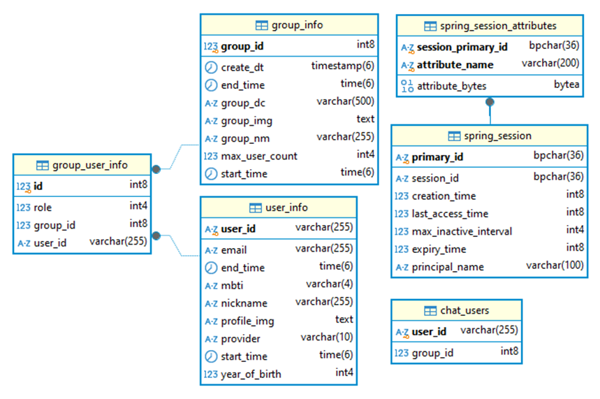 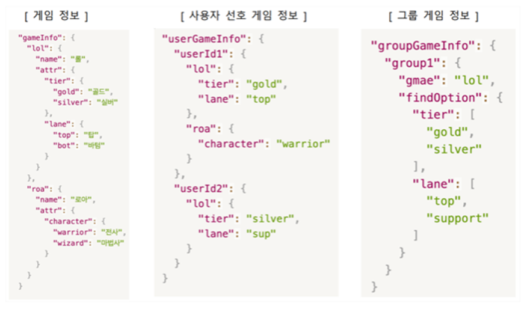

 

## 🏗️ 서비스 아키텍처

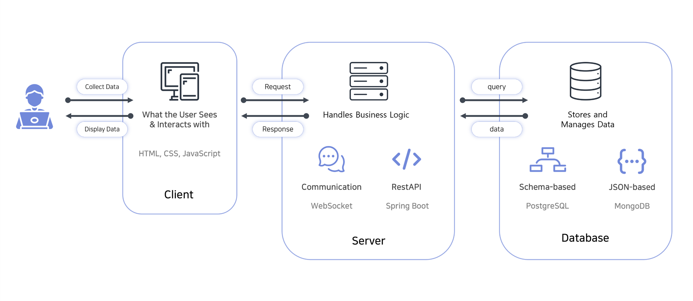

## 화면 구성 📺
|                           로그인                           |                           에러페이지                           |                                                             |
|:-------------------------------------------------------:|:---------------------------------------------------------:|:-----------------------------------------------------------:|
|   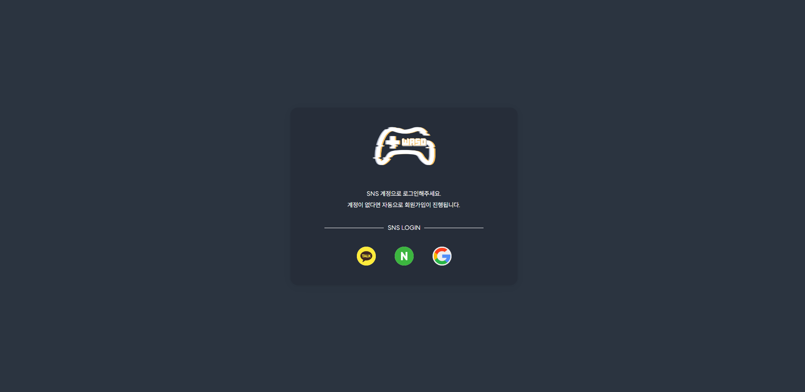   |  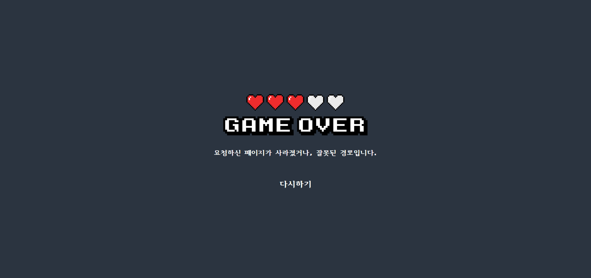  |                                                             |
|                     회원가입 (회원 정보 입력)                     |                      회원가입 (선호 게임 선택)                      |                     회원가입 (선호 게임 정보 입력)                      |  
| 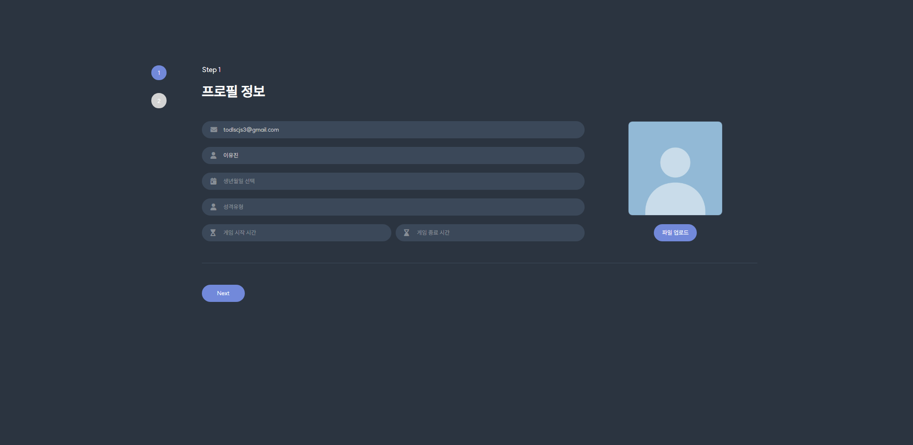  |  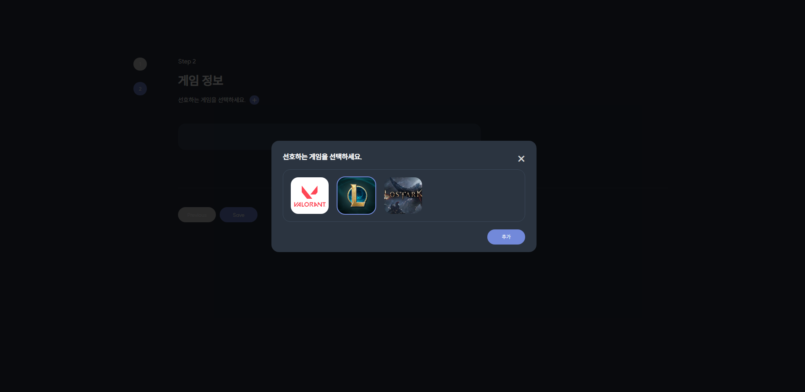   |   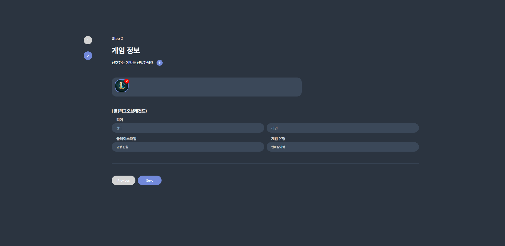    |  
|                          그룹 목록                          |                         그룹 정보 조회                          |                            그룹 생성                            |
| 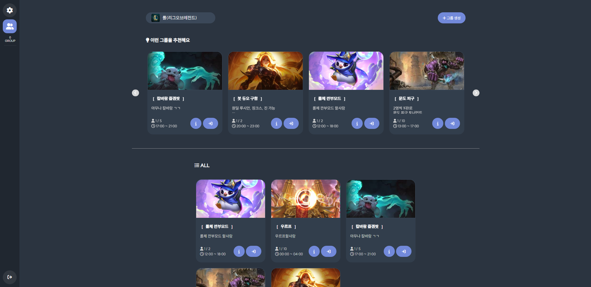 | 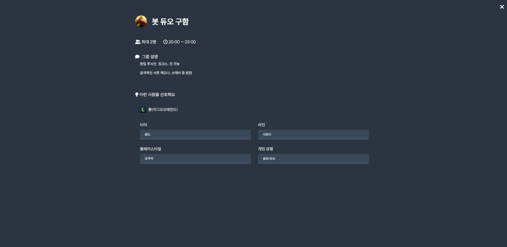 |   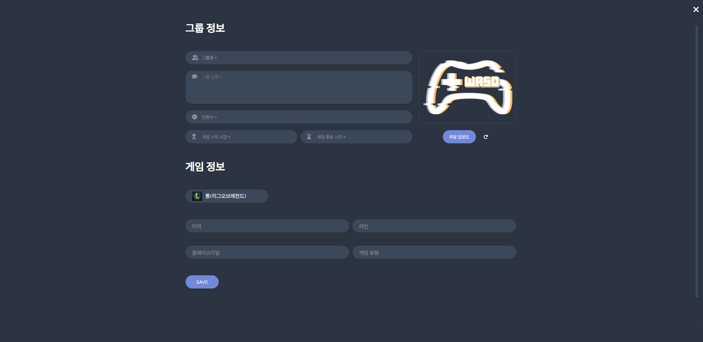    |
|                          그룹 참여                          |                          그룹 채팅방                           |                           프로필 수정                            |
| 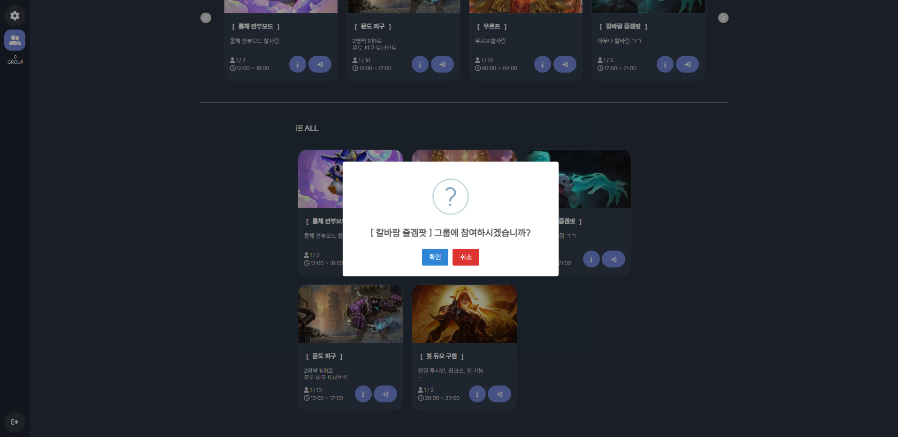 |  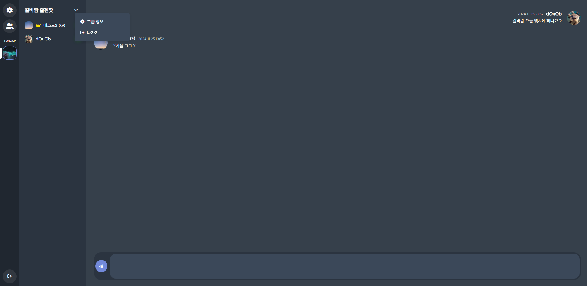  | 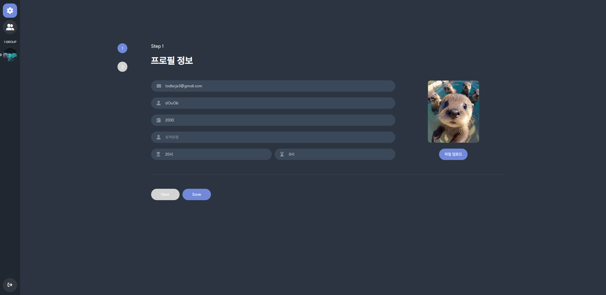 |

## 🤔️ 기술적 의사 결정

사용된 기술을 선택한 이유와 근거

| 요구 사항                | 선택지                           | 핵심 기술을 선택한 이유 및 근거                                                                                                                                     |
|:-------------------------:|:------------------------------|:-------------------------------------------------------------------------------------------------------------------------------------------------------|
| 게임 데이터 관리 방식      | - PostgreSQL - MongoDB    | - 게임 데이터를 관리하는 과정에서 테이블 간의 복잡한 관계로 인해 성능 저하 및 관리가 어려움  - 스키마의 유연성을 위해 JSON 타입을 지원하는 MongoDB 도입 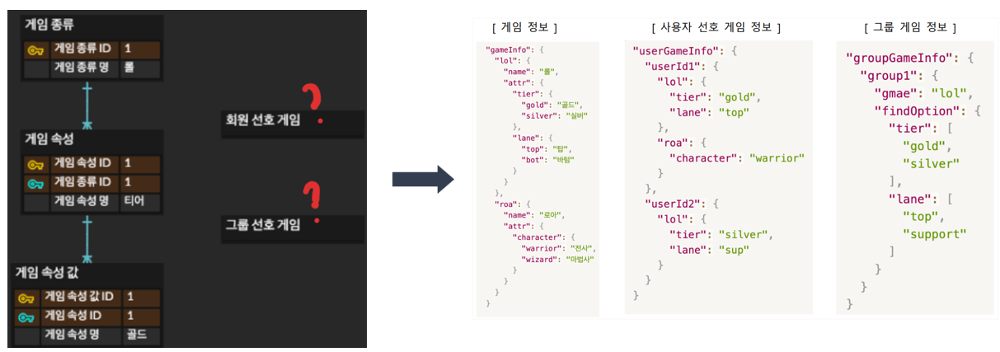 |
| 맞춤형 그룹 추천 알고리즘 | - 기본 조건 필터링 - 가중치 기반 점수 부여 | - 사용자가 입력한 프로필 정보와 그룹 정보 간의 유사성을 비교하여 맞춤형 점수를 계산 - 게임 속성, 게임 시간대 등을 기준으로 높은 연관성을 가진 그룹 추천 - 효율적인 필터링을 위해 기본 조건(인원수 미달 그룹) 선별                     |

 

[//]: # (## 🛠️ 트러블슈팅)

[//]: # (
)

[//]: # (
문제가 발생했을 때 우리는 이렇게 해결했습니다.
)

[//]: # ()
[//]: # (### webRTC 연결 관련 이슈)

[//]: # (|진행 순서| 내용|)

[//]: # (|:---|:---|)

[//]: # (| 😱 문제 |미디어 스트림을 접근 권한을 허가 혹은 거부하지 않으면 소켓이 연결되지 않아 게임을 제대로 진행이 불가능하다. 내 소리를 다른 사람은 들을 수 없으나 나는 다른 사람의 소리를 들을 수 있는 문제가 있음|)

[//]: # (|🤔 원인|미디어 스트림 접근 권한을 요청할 때 코드의 흐름이 정지되기 때문에 이후 코드가 실행되지 않으므로 소켓 연결이 되지 않음 미디어 스트림 권한이 처리되지 않았을 때 다른 사용자가 rtc연결을 요청시 나의 미디어 스트림이 undefined 상태이므로 상대의 음성은 들리나 나의 음성이 전달되지 않음|)

[//]: # (|😭 시도| • getUserMedia&#40;&#41;를 별개의 useEffect로 분리하여 소켓과 rtc를 연결하는 로직에 병렬적으로 처리되게 구현 이 경우 미디어스트림을 허가하기 전에 rtc연결을 요청하므로 내 로컬스트림이 undefined 인 문제가 발생함 • getUserMedia&#40;&#41;함수를 소켓 연결 이후에 호출하도록 변경함. 그러나 이 경우 다른 사용자가 rtc연결을 요청했을 때마이크 접근 권한을 허가하거나 거부하지 않은 상태이면 나의 미디어스트림이 undefined 인 경우가 발생하므로 나의 말을 다른 사람이 들을 수가 없음     |)

[//]: # (|😄 해결| • getUserMedia&#40;&#41;함수를 별개의 useEffect를 이용해 병렬적으로 처리하는 로직은 그대로 둠 • 요청을 받아 rtc연결을 실행하거나, 내가 새로운 rtc연결을 시도하고자 하는 경우 사용자가 마이크 사용을 허가/거부하지 않은 상태면 반복문과 함께 Promise, setTimeOut으로 구현한 sleep함수를 이용해 코드의 흐름을 막음 • 사용자가 마이크 사용을 허가한 경우 그대로 연결을 진행함, 사용을 거부한 경우 본인의 마이크는 사용이 불가능하지만 사용자가 의도한 것이므로 특별히 예외처리하지 않음 |)

[//]: # ()
[//]: # ()
[//]: # ()
[//]: # (
)

 

## 개발자 소개

|                                       이유진                                        |                                       강성현                                        |                                                                                                            
|:--------------------------------------------------------------------------------:|:--------------------------------------------------------------------------------:|  
|  |  |                   
|                      [@y-00jin](https://github.com/y-00jin)                      |                       [@keartt](https://github.com/keartt)                       |
|                               FRONT-END & BACK-END                               |                                        BACK-END                                        |
